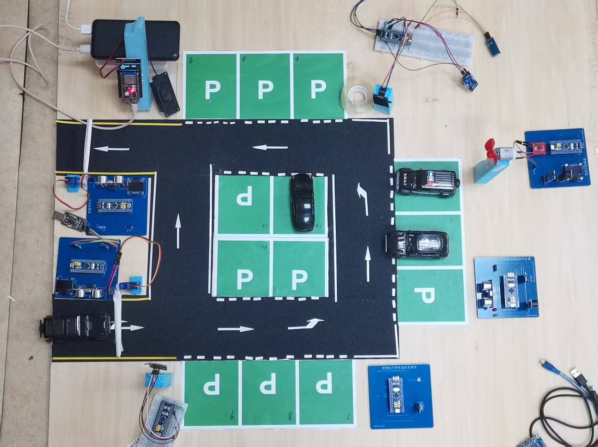

# 物联灵瞳 —— 智慧停车场综合管理系统

> 基于 STM32F103C8T6 的智慧停车场物联网综合管理系统，集成 8 大子系统协同工作，实现从车牌识别入场、窄弯会车调度、盲区预警到车位监测、环境安全联动的全场景覆盖。

## 实物展示



*基于 STM32F103C8T6 核心板 + 各类传感器模块搭建的智慧停车场硬件系统*

## 系统架构

```
┌──────────────────────────────────────────────────────────────────┐
│                    智慧停车场 — 八大子系统                          │
├──────────────────────────────────────────────────────────────────┤
│  入场层  │  车牌识别道闸入场     │  USART 通信 + 舵机抬杆 + 超声波测距 │
│  通行层  │  窄弯协同会车调度     │  双超声波 + 双 OLED + 优先级协调     │
│  安全层  │  柱后盲区预警         │  超声波检测 + OLED + 蜂鸣器报警      │
│  停车层  │  车位状态监测         │  超声波测距 + 红绿 LED + 蜂鸣器      │
│  环境层  │  环境参数监控         │  MQ-2 烟雾+温湿度传感器 + OLED + 串口输出   │
│  安防层  │  消防排烟联动         │  温度传感器 + 直流风扇 + 蜂鸣器       │
│  防汛层  │  水位防洪排水         │  雨滴传感器 + 水位传感器 + 水泵      │
│  照明层  │  光照自适应控制       │  光敏传感器 + PWM 调光 + OLED 菜单  │
└──────────────────────────────────────────────────────────────────┘
```

## 核心功能

| 子系统 | 传感器/执行器 | 功能描述 |
|--------|--------------|----------|
| **车牌识别入场** | 串口通信 / 舵机 / HC-SR04 | 接收车牌信息，超声波检测车辆距离，舵机控制道闸自动抬杆/落杆，OLED 显示剩余车位 |
| **窄弯协同会车** | 双路 HC-SR04 / 双 OLED | 检测窄弯两侧车辆，冲突时优先级协调通行，蜂鸣器实时提示 |
| **柱后盲区预警** | HC-SR04 / OLED / 蜂鸣器 | 检测柱子后方盲区障碍物，距离 ≤30cm 触发声光报警 |
| **车位状态监测** | HC-SR04 / 红绿 LED | 超声波判断车位占用状态，红灯占位/绿灯空闲，超温蜂鸣报警 |
| **环境参数监控** | MQ-2 烟雾传感器 | 实时检测停车场烟雾浓度(ppm)，OLED 显示 + 串口数据上报 |
| **消防排烟联动** | NTC 温感 / 直流电机 | 温度超过阈值自动启动排烟风扇，蜂鸣器报警，OLED 显示温度曲线 |
| **水位防洪排水** | 雨滴传感器 / 水位传感器 | 监测雨量和水位，超警戒自动启动水泵排水，安全线以下自动关闭 |
| **光照自适应控制** | 光敏传感器 / PWM LED | 检测环境光照强度，非线性 PWM 调节停车场照明亮度 |

## 功能描述

一、车牌识别与道闸入场系统
基于 USART 串口通信搭建 PC 端与 STM32 端数据交互链路，设计自定义帧格式及数据校验逻辑保障传输可靠性。PC 端通过 ESP-CAM 采集图像并利用 YOLOv8 完成车牌识别，结果经串口下发至 STM32 解析。采用串口中断配合环形缓冲区实现不丢帧接收，解决了车牌数据跨端同步的核心问题。结合超声波测距检测车辆到达，通过 PWM 控制舵机实现道闸自动抬杆/落杆，OLED 实时显示车牌与车位状态，完成从识别到放行的自动化入场流程。

二、窄弯协同会车调度系统
针对停车场窄弯双向来车冲突场景，部署双路超声波传感器分别检测两侧车辆接近情况。设计优先级调度状态机算法，当两侧同时来车时根据到达顺序及距离判定通行优先级。优先方 OLED 显示"通行"指示，等待方显示"避让"提示并触发蜂鸣器提醒。系统有效解决窄弯会车冲突，提升了停车场通行效率与安全性。

三、柱后盲区预警系统
针对转角柱后视觉盲区碰撞隐患，利用超声波传感器部署于柱体侧后方，基于 TIM 输入捕获精确测量障碍物距离。当检测到盲区范围内（≤30cm）存在障碍物或行人时，立即触发蜂鸣器声光报警，OLED 实时展示距离与预警状态。系统实现了转角盲区的主动安全预警，有效降低视觉盲区导致的碰撞风险。

四、车位状态监测系统
利用超声波传感器安装于车位上方，通过测距数据与阈值对比判断车位占用状态。空闲时绿灯指示，占用时红灯指示，OLED 汇总展示停车场剩余车位数量。同时集成超温蜂鸣报警功能，当环境温度异常时触发安全告警。该系统实现了车位占用状态的实时感知与可视化引导，为停车场管理提供精确数据支撑。

五、环境参数监控系统
基于 MQ-2 烟雾传感器实时检测停车场烟雾浓度，模拟信号经 ADC 转换并配合 DMA 循环采样实现自动采集，有效降低 CPU 负载。采样值经浓度换算为 ppm 值后，OLED 实时展示浓度数值及趋势曲线，同时通过串口上报至上位机监控平台。当浓度超阈值时触发报警联动，实现环境安全参数的实时监测与数据上报。

六、消防排烟联动系统
利用 NTC 热敏电阻实时监测环境温度，OLED 显示当前温度及变化曲线。当温度超过安全阈值时，自动启动直流电机驱动排烟风扇，PWM 调速控制转速随温度等级动态调整，同步触发蜂鸣器报警。温度回落后自动关闭排烟设备，并部署 IWDG 独立看门狗保障长时间运行可靠性，防止死机导致消防联动失效。

七、水位防洪排水系统
集成雨滴传感器与水位传感器双重监测，ADC 多通道配合 DMA 实现数据并行采集。当降雨量超阈值且水位达警戒线时，通过继电器驱动水泵自动启动排水，OLED 实时显示水位高度与水泵运行状态。水位降至安全线后自动关闭水泵，实现智能排水闭环控制，保障极端天气下停车场安全运行。

八、光照自适应控制系统
基于光敏传感器检测环境光照强度，经 ADC 采样后通过非线性亮度映射算法转换为 PWM 占空比，动态调节 LED 照明亮度。光照充足时降低亮度节能，不足时自动提升亮度保障照明。OLED 实现多级菜单交互界面，可查看光照值与调节模式，实现了停车场照明的智能化节能管理。

## 仓库结构

```
IoT-Lingtong/
├── picture.jpg                 # 系统实物图
├── license-plate-entry/        # 车牌识别入场子系统
├── narrow-curve-cooperative/   # 窄弯协同会车子系统
├── pillar-blind-spot/          # 柱后盲区预警子系统
├── parking-space-sensor/       # 车位状态监测子系统
├── environment-monitor/        # 环境参数监控子系统 (MQ-2)
├── fire-safety-fan/            # 消防排烟联动子系统
├── flood-drainage-control/     # 水位防洪排水子系统
├── ambient-light-control/      # 光照自适应控制子系统
└── README.md                   # 项目说明
```

## 技术栈

| 层级 | 技术 |
|------|------|
| 主控 | STM32F103C8T6 (ARM Cortex-M3, 72MHz) |
| 传感器 | HC-SR04 超声波 × N、MQ-2 烟雾传感器、NTC 温度传感器、光敏传感器、雨滴传感器、水位传感器 |
| 执行器 | SG90 舵机、直流电机、水泵、LED、蜂鸣器 |
| 显示 | OLED (I2C, 0.96 英寸) |
| 通信 | USART 串口通信 |
| 外设 | GPIO、ADC、TIM/PWM、IWDG 独立看门狗 |
| 编译 | Keil MDK-ARM |

## 演示视频

[🎬 观看 B 站演示视频](https://www.bilibili.com/video/BV1DWTT6sEzi/)

## 使用说明

1. **硬件连接**：各子系统独立接线，按各自模块的 `Hardware/` 目录下引脚定义连接传感器与执行器
2. **固件编译**：使用 Keil MDK 打开对应子系统目录下的 `.uvprojx` 工程文件，编译烧录
3. **独立运行**：各子系统均可独立运行与演示，互不依赖
4. **系统联调**：全部 8 个子系统同时上电即可构成完整的智慧停车场综合管理系统

## 开源协议

本项目传感器驱动代码参考开源社区实现，系统架构、业务逻辑及多模块协同联调为自主设计开发，仅用于个人学习及求职展示。
代码仅供学习交流，未经作者许可不得用于商业用途。
